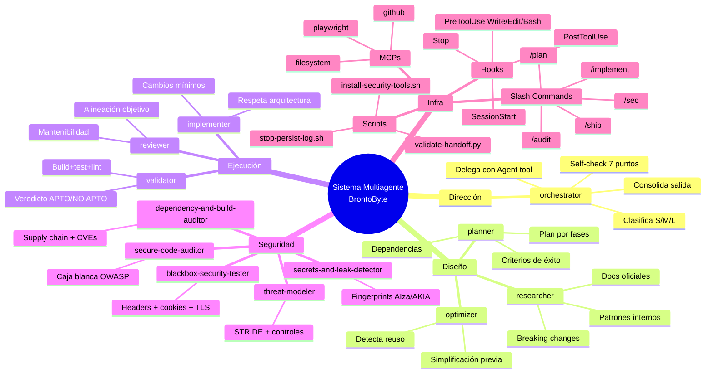
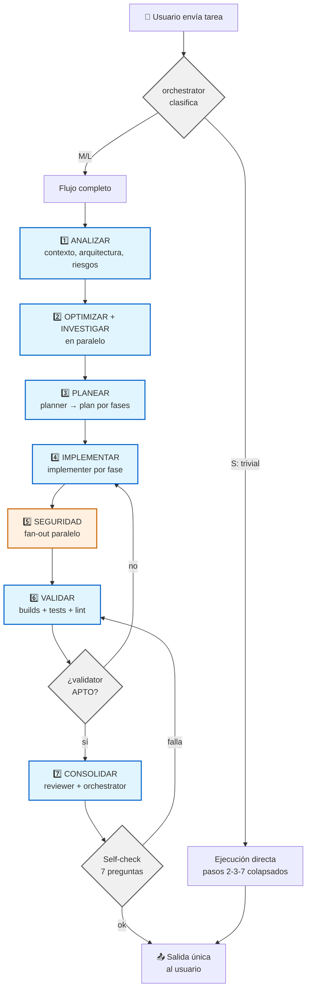
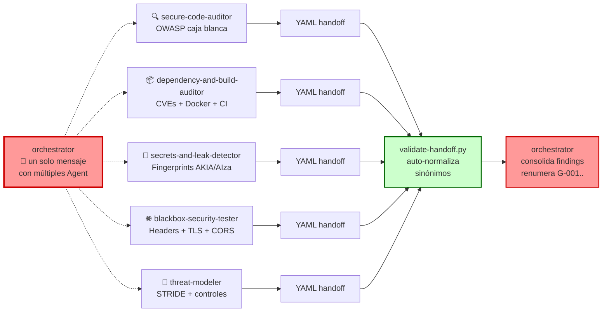
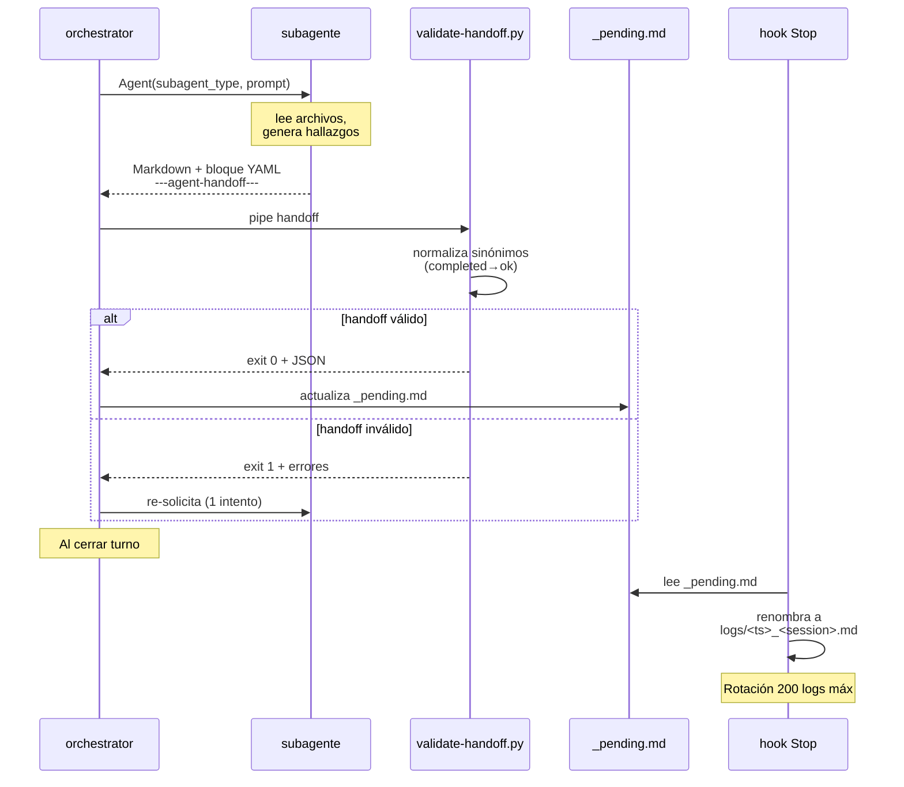
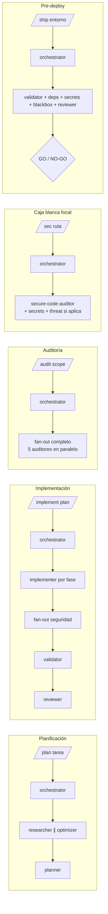
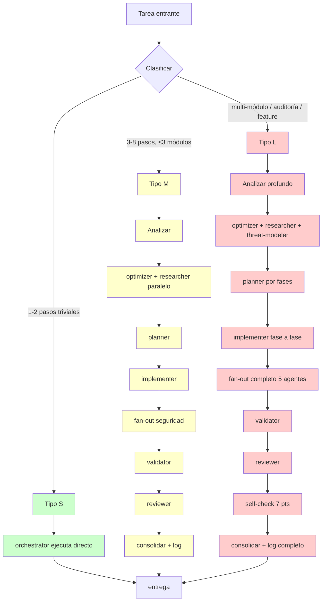
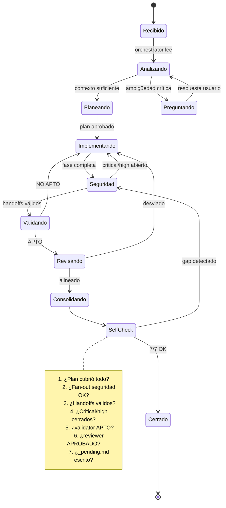
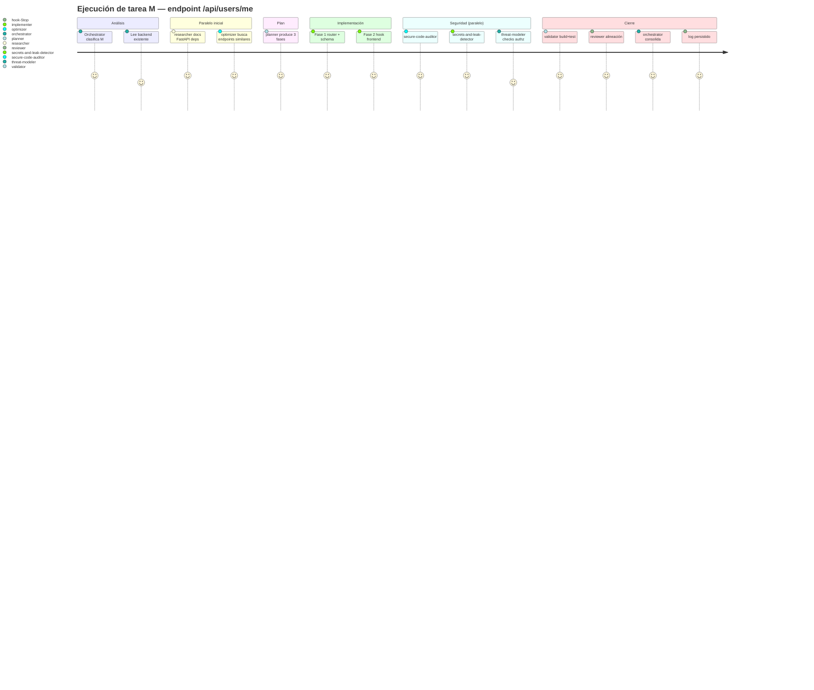

# Flujo del Sistema Multiagente BrontoByte

> Mapa conceptual + diagramas de flujo del harness multiagente instalado en `.claude/`.
> Todos los diagramas están en Mermaid (render nativo en VS Code / GitHub).

---

## 1. Mapa conceptual — Componentes del sistema



---

## 2. Flujo de los 7 pasos obligatorios



---

## 3. Fan-out paralelo de seguridad (Paso 5 en detalle)



**Nota:** los 5 agentes corren **concurrentemente** en procesos aislados (duración real medida: ~32s para 3 agentes, no ~95s secuencial).

---

## 4. Ciclo de vida de un handoff



---

## 5. Paralelismo — Matriz de co-ejecución

```mermaid
gantt
    title Ejecución de una tarea M/L en el tiempo
    dateFormat  s
    axisFormat %Ss

    section Bloque A (paralelo)
    researcher          :a1, 0, 30s
    optimizer           :a2, 0, 20s
    threat-modeler*     :a3, 0, 35s

    section Bloque B
    planner             :b1, after a1 a2 a3, 15s

    section Bloque C (secuencial por fases)
    implementer fase 1  :c1, after b1, 20s
    implementer fase 2  :c2, after c1, 20s

    section Bloque D Seguridad (fan-out paralelo)
    secure-code-auditor :d1, after c2, 35s
    dep-and-build       :d2, after c2, 30s
    secrets-leak        :d3, after c2, 25s
    blackbox*           :d4, after c2, 40s

    section Bloque E
    validator           :e1, after d1 d2 d3 d4, 60s
    reviewer            :e2, after e1, 20s

    section Bloque F
    consolidación       :f1, after e2, 5s
```



`*` threat-modeler y blackbox son condicionales (si cambia auth / si hay URL).

---

## 6. Flujo de hooks — ¿cuándo se disparan?

```mermaid
flowchart TD
    START[Inicio sesión Claude Code] --> SS[🪝 SessionStart<br>inyecta contrato multiagente]
    SS --> WORK[Trabajo en curso]

    WORK --> TOOL{Tool a invocar}
    TOOL -->|Write/Edit| PW[🛡️ pre-write-guard.sh<br>bloquea .env, *.pem, *.key]
    PW -->|exit 0| EDIT[ejecuta Write/Edit]
    PW -->|exit 2| STOP1[❌ bloqueado]

    EDIT --> POST[🔍 post-edit-scan.sh<br>escanea archivo editado]
    POST -->|secreto detectado| WARN[⚠️ aviso al agente]
    POST --> NEXT[siguiente acción]
    WARN --> NEXT

    TOOL -->|Bash| PB[🛡️ pre-bash-guard.sh<br>bloquea rm -rf /, curl\|bash]
    PB -->|exit 0| RUN[ejecuta comando]
    PB -->|exit 2| STOP2[❌ bloqueado]

    RUN --> NEXT
    NEXT --> WORK

    WORK -->|fin de turno| SE[🪝 Stop hook<br>stop-persist-log.sh]
    SE --> PROM[promueve _pending.md<br>→ logs/ts_session.md]
    PROM --> END[Cierre]

    classDef hook fill:#ffcccc,stroke:#990000,stroke-width:2px
    classDef block fill:#ff6666,stroke:#990000,stroke-width:3px
    class SS,PW,POST,PB,SE hook
    class STOP1,STOP2 block
```

---

## 7. Slash commands — Atajos disponibles



---

## 8. Arquitectura de archivos

```
.claude/
├── CLAUDE.md                    ← contrato operativo (7 pasos, reglas)
├── AGENT_HANDOFF.md             ← schema YAML de hand-off + ⚠️ formato literal
├── flujo.md                     ← este archivo
├── settings.local.json          ← permisos + hooks + env
├── .gitignore
│
├── agents/                      ← 12 subagentes especializados
│   ├── orchestrator.md          [opus]
│   ├── planner.md               [opus]
│   ├── reviewer.md              [opus]
│   ├── secure-code-auditor.md   [opus]
│   ├── threat-modeler.md        [opus]
│   ├── optimizer.md             [sonnet]
│   ├── researcher.md            [sonnet]
│   ├── implementer.md           [sonnet]
│   ├── validator.md             [sonnet]
│   ├── blackbox-security-tester.md   [sonnet]
│   ├── dependency-and-build-auditor.md [sonnet]
│   └── secrets-and-leak-detector.md  [sonnet]
│
├── commands/                    ← slash commands
│   ├── plan.md
│   ├── implement.md
│   ├── audit.md
│   ├── sec.md
│   └── ship.md
│
├── scripts/                     ← hooks + validación + instalador
│   ├── pre-write-guard.sh       (hook PreToolUse Write/Edit)
│   ├── pre-bash-guard.sh        (hook PreToolUse Bash)
│   ├── post-edit-scan.sh        (hook PostToolUse)
│   ├── stop-persist-log.sh      (hook Stop)
│   ├── validate-handoff.py      (validador YAML tolerante)
│   └── install-security-tools.sh
│
└── logs/                        ← trazabilidad automática
    ├── _pending.md              (buffer del turno actual, gitignored)
    └── <timestamp>_<session>.md (archivados por el hook Stop)
```

Raíz del proyecto:

```
BrontoByte/
├── .gitignore                   ← ignora .env, dist, node_modules, logs
├── .mcp.json                    ← MCPs compartidos (filesystem, github, playwright, fetch)
├── frontend-brontobyte/
├── backend-brontobyte/
└── .claude/                     (arriba)
```

Memoria global de usuario:

```
~/.claude/projects/c--Users-Felipe-Documents-BrontoByte/memory/
├── MEMORY.md                    ← índice
├── project_brontobyte.md        (proyecto)
├── project_agent_system.md      (sistema multiagente)
└── feedback_work_style.md       (preferencias del usuario)
```

---

## 9. Modelo de decisión del orchestrator



---

## 10. Ciclo de retroalimentación y autocorrección



---

## 11. Ejemplo real — Tarea M paso a paso

**Usuario:** *"Agrega endpoint `/api/users/me` que devuelva el perfil autenticado."*



---

## 12. Glosario rápido

| Término | Definición |
|---|---|
| **Orchestrator** | Agente director único punto de entrada. Nunca implementa en M/L, siempre delega. |
| **Hand-off** | Bloque YAML entre `---agent-handoff---` y `---end-handoff---` que todo subagente emite al terminar. |
| **Fan-out** | Lanzamiento paralelo de múltiples subagentes en un solo mensaje. |
| **S/M/L** | Clasificación de tamaño: Small (trivial), Medium (3-8 pasos), Large (auditoría/feature). |
| **STRIDE** | Marco de amenazas: Spoofing, Tampering, Repudiation, Information disclosure, DoS, Elevation of privilege. |
| **Self-check 7 puntos** | Preguntas internas del orchestrator antes de cerrar M/L. |
| **`_pending.md`** | Buffer del turno actual; el hook Stop lo archiva con timestamp. |
| **BFF** | Backend-for-Frontend; patrón usado para ocultar IA/servicios externos al cliente. |
| **Harness** | Infraestructura ejecutable (no solo doc) que fuerza el flujo: hooks + validador + logs. |

---

## 13. Resumen ejecutivo del flujo

1. **Usuario** escribe tarea (o usa `/audit`, `/plan`, etc.).
2. **Orchestrator** clasifica S/M/L y ejecuta el flujo de 7 pasos.
3. **Optimizer + researcher** en paralelo aportan contexto.
4. **Planner** produce plan verificable por fases.
5. **Implementer** ejecuta fase a fase.
6. **Fan-out seguridad** (hasta 5 agentes paralelos) audita sin bloquearse entre sí.
7. **validate-handoff.py** normaliza y valida cada YAML de subagente.
8. **Validator** certifica build/tests/lint.
9. **Reviewer** confirma alineación con el objetivo.
10. **Orchestrator** consolida, responde `Self-check 7 puntos`, emite salida final.
11. **Hook Stop** archiva `_pending.md` → `logs/<timestamp>_<session>.md`.
12. **Hooks PreTool** bloquean en vivo escrituras a `.env` y comandos destructivos.

**Resultado:** equipo técnico coordinado, trazable, defensivo y reproducible.
